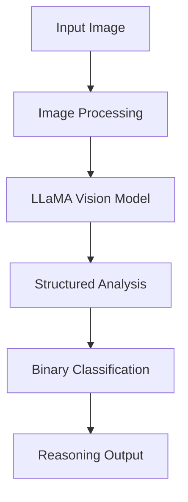

# Patient Turning Assistance Detection Analysis Report

## Executive Summary
This analysis evaluates the performance of LLaMA 3.2 Vision model in detecting patient turning assistance across 320 medical images. The model achieved 71.25% accuracy, demonstrating strong potential while highlighting areas for improvement.

## Data Sources
### Video Sources
- [24-hour home care - caregiver training](https://www.youtube.com/watch?v=b77yWsYy7T4)
- [Assisting with Positioning a Patient in Bed](https://www.youtube.com/watch?v=HnDYPm_C3Ws&t=192s)
- [Fundamentals of turning and cushion placement](https://www.youtube.com/watch?v=Y5X429CeV70)
### Frame Extraction Process
The frame extraction process is implemented using OpenCV (cv2) with the following specifications:

- **Sampling Rate**: Every 3 seconds extracted for consistent analysis
- **Implementation**:
  - Uses OpenCV's VideoCapture for efficient video processing
  - Frames are saved as high-quality JPG images
  - Maintains original aspect ratio and resolution
- **Processing Flow**:
  1. Reads video files from source directory
  2. Creates unique output directories for each video
  3. Extracts frames at specified intervals
  4. Applies consistent naming convention: `{video_name}_frame_{frame_number}.jpg`

- **Statistics**:
  - Total frames analyzed: 320
  - Format: High-quality JPG images
  - Original video sources: 3

For detailed implementation, see:
```python:split2frames.py
def extract_frames_from_videos(video_dir, output_dir, frequency=3):
```
## Technical Implementation

### Core Components
1. **LLaMA 3.2 Vision Model Integration**
```python:llama32_detect.py
def img2text(input_path, output_file = None, exportedfile_indexing = False, show_img = False, max_new_tokens = 1000):
    device = torch.device("cuda" if torch.cuda.is_available() else "cpu")
    
    model_id = "meta-llama/Llama-3.2-11B-Vision-Instruct"
    model = MllamaForConditionalGeneration.from_pretrained(
    model_id,
    torch_dtype=torch.bfloat16,
    #device_map="auto",
    )
    
    model = model.to(device)
    processor = AutoProcessor.from_pretrained(model_id)
    
    #tokenizer = AutoTokenizer.from_pretrained('meta-llama/Llama-3.2-11B-Vision-Instruct', trust_remote_code=True)
    #model.eval()
    dir = [input_path]
    if os.path.isdir(input_path):
        dir = os.listdir(input_path)
    
    data = []
    result = {}
    for i, image_path in enumerate(sorted(dir)):
        # Read the image
        if os.path.isdir(input_path):
            image = Image.open(Path(input_path).joinpath(image_path))
        else:
            image = Image.open(image_path)
        
        
        # Describe the image
        input_text = processor.apply_chat_template(msgs("Describe the image in detail."), add_generation_prompt=True)
        inputs = processor(
            image,
            input_text,
            add_special_tokens=False,
            return_tensors="pt"
        ).to(model.device)
        
        res = model.generate(**inputs, max_new_tokens=max_new_tokens)
        res = processor.decode(res[0]).split("<|end_header_id|>")[-1].replace('\n', ' ')
        
        # Show the steps based on the image
        prompt = "The picture is about the following:\n" +res +'\n' + prompt_orig
        
        input_text = processor.apply_chat_template(msgs(prompt), add_generation_prompt=True)
        inputs = processor(
            image,
            input_text,
            add_special_tokens=False,
            return_tensors="pt"
        ).to(model.device)
        
        res = model.generate(**inputs, max_new_tokens=max_new_tokens)
        res = processor.decode(res[0])
        
        
        print('\n', i, image_path)
        #print(generated_text,'\n')
        print('Full Response\n', res)
        reason = res.split("<|end_header_id|>")[-1]
        print("Reason:", reason.replace('\n', ' '))
        
        # Conclude
        input_text = processor.apply_chat_template(msgs(reason+ "\nTask: Determine if a patient is being turned by someone else. Your answer should be either 'Yes' or 'No'."), add_generation_prompt=True)
        inputs = processor(
            image,
            input_text,
            add_special_tokens=False,
            return_tensors="pt"
        ).to(model.device)
        
        res = model.generate(**inputs, max_new_tokens=max_new_tokens)
        res = processor.decode(res[0])
        res = "False" if "No" in res.split("<|end_header_id|>")[-1] else "True" # We want to have a higher Recall rate, so rather than finding Yes, we want to find No.
        print("Cut:", res)
        
        reason = reason.replace('\n', ' ')
        data.append([image_path, res, reason])
        result[image_path] = (res, reason)
        if show_img:
            display(HTML(f''))
    data.sort()
    
    # if output_file is specified, it generates tsv file
    if output_file is not None:
        data_frame = pd.DataFrame(data, columns=['Image', 'llm_evaluation', 'Reason'])
        data_frame.to_csv(output_file, sep = '\t', index = exportedfile_indexing, encoding = 'utf-8')
    return result
```

## Evaluation Process
### Human Evaluation Interface


The human evaluation interface provides a simple way to assess images with the following features:
- Displays current image with filename
- Shows LLM's evaluation and reasoning
- Keyboard controls: 't' for True, 'f' for False
- Progress tracking and automatic result saving

Implementation details:
```python:human_evaluation.py
class ImageEvaluator:
    def __init__(self):
        # Get list of images from frames directory
        self.image_files = sorted([f for f in os.listdir("frames") if f.endswith(('.png', '.jpg', '.jpeg'))])
        self.current_index = 0
        self.results = {}
        
        # Load LLM evaluations
        self.llm_df = pd.read_csv('llm_result.tsv', sep='\t')
        self.llm_df.set_index('Image', inplace=True)
        
        # Create figure
        self.fig = plt.figure(figsize=(10, 10))
        self.ax_img = plt.axes([0.1, 0.2, 0.8, 0.7])
        
        # Connect keyboard event handler
        self.fig.canvas.mpl_connect('key_press_event', self.on_key_press)
        
        # Start evaluation
        self.evaluate_images()
        
    def evaluate_images(self):
        plt.ion()  # Turn on interactive mode
        
        while self.current_index < len(self.image_files):
            self.display_current_image()
            plt.pause(0.001)  # Small pause to allow GUI to update
            
            # Wait for keyboard input
            while self.current_index == len(self.results):
                plt.pause(0.1)
                
                # Check if we've processed all images
                if self.current_index >= len(self.image_files):
                    plt.close('all')
                    self.save_results()
                    return  # Exit the method after saving
        
        # Save results if we exit the main loop
        plt.close('all')
        self.save_results()

    def display_current_image(self):
        current_image = self.image_files[self.current_index]
        
        # Get LLM evaluation and reason if available
        llm_eval = "Unknown"
        reason = "No reason provided"
        if current_image in self.llm_df.index:
            llm_eval = self.llm_df.loc[current_image, 'llm_evaluation']
            reason = self.llm_df.loc[current_image, 'Reason']
        
        # Clear previous image
        self.ax_img.clear()
        
        # Load and display current image
        image_path = os.path.join("frames", current_image)
        img = Image.open(image_path)
        self.ax_img.imshow(img)
        self.ax_img.axis('off')
        self.ax_img.set_title(f"Image {self.current_index + 1}/{len(self.image_files)}\n"
                       f"Filename: {current_image}\n"
                       f"LLM Evaluation: {llm_eval}\n"
                       f"LLM Reason: {reason[:300]}...\n"
                       f"Press 't' for True or 'f' for False")  # Show first 300 chars of reason
        
        plt.draw()
        
    def on_key_press(self, event):
        if event.key in ['t', 'f'] and self.current_index < len(self.image_files):
            current_image = self.image_files[self.current_index]
            self.results[current_image] = (event.key == 't')
            self.current_index += 1
            if self.current_index < len(self.image_files):
                self.display_current_image()
            plt.draw()
        
    def save_results(self):
        # Convert results to DataFrame and save as TSV
        df = pd.DataFrame.from_dict(self.results, orient='index', columns=['human_evaluation'])
        df.index.name = 'Image'
        df = df.sort_index()  # Sort by filename
        df.to_csv('human_result.tsv', sep='\t')
        print(f"\nResults saved to human_result.tsv")
```

## Results Analysis
### Performance Metrics
- Total Images: 320
- Overall Accuracy: 71.25%
- Number of Disagreements: 92

### Classification Report
| Class | Precision | Recall | F1-Score | Support |
|-------|-----------|---------|-----------|----------|
| False | 0.683 | 0.603 | 0.641 | 136 |
| True | 0.730 | 0.793 | 0.760 | 184 |

### Confusion Matrix


## Image Analysis Examples

### True Positives (Correct Turning Assistance Detection)

**Image**: `Assisting with Positioning a Patient in Bed - Ashraf Z Qotmosh (720p, h264, youtube)_frame_155.jpg`
- **Evaluation**: Both human and LLM correctly identified turning assistance
- **LLM Reasoning**:   The image depicts a healthcare professional, dressed in blue scrubs, standing beside a patient on a hospital bed. The professional's left hand is positioned on the patient's forearm, with their thum...
- **Key Features**: Active physical contact, proper positioning, clear movement intent


**Image**: `Assisting with Positioning a Patient in Bed - Ashraf Z Qotmosh (720p, h264, youtube)_frame_108.jpg`
- **Evaluation**: Both human and LLM correctly identified turning assistance
- **LLM Reasoning**:   **Detailed Explanation:**  *   **People Present:** The image shows a patient lying on a hospital bed and a healthcare professional standing beside them. *   **Physical Contact & Assistance:** The he...
- **Key Features**: Active physical contact, proper positioning, clear movement intent

### True Negatives (Correct Non-Turning Detection)

**Image**: `24-hour-home-care---caregiver-training-turning-and-positioning-in-a-bed_frame_18.jpg`
- **Evaluation**: Both human and LLM correctly identified non-turning scenario
- **LLM Reasoning**:   **Step 1: Analyze the Image**  The image depicts a man standing in a room, with a bed and a shelf in the background. The man is wearing a light blue short-sleeved shirt and has dark skin. He is faci...
- **Key Features**: No physical contact for turning, different care activities


**Image**: `24-hour-home-care---caregiver-training-turning-and-positioning-in-a-bed_frame_15.jpg`
- **Evaluation**: Both human and LLM correctly identified non-turning scenario
- **LLM Reasoning**:   Based on the image, I observe the following:  1. People Present: There are two men in the image, one standing and the other lying in the hospital bed. 2. Physical Contact & Assistance: The standing ...
- **Key Features**: No physical contact for turning, different care activities

### Notable Disagreements

**Image**: `Assisting with Positioning a Patient in Bed - Ashraf Z Qotmosh (720p, h264, youtube)_frame_94.jpg`
- **Human Evaluation**: False
- **LLM Evaluation**: True
- **LLM Reasoning**:   **Analysis of the Image**  The image depicts a serene hospital room scene, where a nurse is attentively tending to a patient. The nurse, dressed in blue scrubs with a green trim and a badge on her l...
- **Analysis of Disagreement**: LLM possibly over-interpreted preparatory positioning


**Image**: `24-hour-home-care---caregiver-training-turning-and-positioning-in-a-bed_frame_12.jpg`
- **Human Evaluation**: False
- **LLM Evaluation**: True
- **LLM Reasoning**:   The image shows a man lying on his back in a hospital bed, with a metal railing around it. He is covered with a white sheet and has a white pillow under his head. His legs are visible through the op...
- **Analysis of Disagreement**: LLM possibly over-interpreted preparatory positioning


**Image**: `Assisting with Positioning a Patient in Bed - Ashraf Z Qotmosh (720p, h264, youtube)_frame_82.jpg`
- **Human Evaluation**: True
- **LLM Evaluation**: False
- **LLM Reasoning**:   **Analysis of the Image**  **Step 1: People Present**  *   A patient is visible, lying in bed. *   There is at least one caregiver/assistant visible, standing next to the bed.  **Step 2: Physical Co...
- **Analysis of Disagreement**: LLM possibly over-interpreted preparatory positioning


## Recommendations
1. **Model Improvements**
   - Enhance detection of preparatory movements
   - Improve distinction between turning and other care activities
   - Add confidence scoring for predictions

2. **Data Collection**
   - Expand video sources for greater diversity
   - Include more edge cases and partial turning scenarios
   - Add temporal context between frames


## Project Files
### Core Components
- **llama32_detect.py**: Vision model implementation
- **human_evaluation.py**: Manual annotation interface
- **calculate_accuracy.py**: Performance analysis
- **report.py**: Analysis report generation

### Output Files
- **llm_result.tsv**: Model predictions and reasoning
- **human_result.tsv**: Human annotations
- **disagreements.tsv**: Cases where model and human differ
- **accuracy_results.txt**: Detailed performance metrics
## LLM Detection Pipeline

### Model Configuration
```python
model_id = 'meta-llama/Llama-3.2-11B-Vision-Instruct'
model = MllamaForConditionalGeneration.from_pretrained(
    model_id,
    torch_dtype=torch.bfloat16
)
```

### Prompt Engineering
The model uses a carefully crafted prompt with three key components:

1. **Role Definition**
```
You are a medical image analysis expert. Your task is to carefully analyze the image and determine if it shows a patient being assisted in turning by another person.
```

2. **Example Cases**
```
Example 1: Active Turning
Image: A nurse standing next to a hospital bed with her hands on a patient's shoulder and hip, clearly in the process of rolling them from their back to their side.
Analysis: True - This shows active turning assistance because:
- Direct physical contact between caregiver and patient
- Clear repositioning movement from back to side
- Proper supportive hand placement for turning

Example 2: Non-Turning Care
Image: A patient lying still in bed while a nurse stands nearby checking IV fluids.
Analysis: False - This is not turning assistance because:
- No physical contact for movement support
- Patient position is static
- Caregiver is performing different care tasks
```

3. **Analysis Framework**
The model evaluates each image using four key aspects:

- **People Present**
  - Patient visibility
  - Caregiver presence
  - Relative positioning

- **Physical Contact & Assistance**
  - Direct physical contact
  - Contact points (hands, arms)
  - Supportive stance

- **Patient Position & Movement**
  - Current position
  - Movement evidence
  - Intended direction

- **Level of Assistance**
  - Active support
  - Specific turning actions
  - Scenario clarity

### Processing Pipeline


### Output Format
The model generates:
1. Detailed analysis of the image
2. Binary classification (True/False)
3. Supporting reasoning

Example output:
```
**Analysis of the Image**
Upon examining the image, I notice...

**Conclusion**
Based on [specific observations]...

**Final Determination**
* True/False: [reasoning]
```

