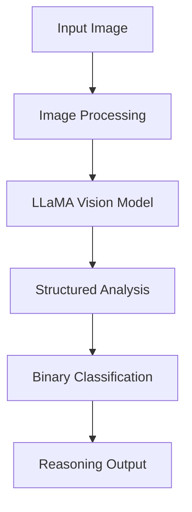

# Patient Turning Assistance Detection Analysis Report

## Executive Summary
This analysis evaluates the performance of LLaMA 3.2 Vision model in detecting patient turning assistance across 320 medical images. The model achieved 71.25% accuracy, demonstrating strong potential while highlighting areas for improvement.

## Data Sources
### Video Sources
- [24-hour home care - caregiver training](https://www.youtube.com/watch?v=b77yWsYy7T4)
- [Assisting with Positioning a Patient in Bed](https://www.youtube.com/watch?v=HnDYPm_C3Ws&t=192s)
- [Fundamentals of turning and cushion placement](https://www.youtube.com/watch?v=Y5X429CeV70)
### Frame Extraction Process

The frame extraction process is implemented using OpenCV (cv2) with the following specifications:

- **Sampling Rate**: Every 3 seconds extracted for consistent analysis
- **Implementation**:
  - Uses OpenCV's VideoCapture for efficient video processing
  - Frames are saved as high-quality JPG images
  - Maintains original aspect ratio and resolution
- **Processing Flow**:
  1. Reads video files from source directory
  2. Creates unique output directories for each video
  3. Extracts frames at specified intervals
  4. Applies consistent naming convention: `{video_name}_frame_{frame_number}.jpg`

- **Statistics**:
  - Total frames analyzed: 320
  - Format: High-quality JPG images
  - Original video sources: 3

For detailed implementation, see:
```python:split2frames.py
def extract_frames_from_videos(video_dir, output_dir, frequency=3):
    # Implementation details
```

## Technical Implementation

### Core Components
1. **LLaMA 3.2 Vision Model Integration**
```python:llama32_detect.py
startLine: 29
endLine: 96
```

## Evaluation Process
### Human Evaluation Interface
```python:human_evaluation.py
startLine: 9
endLine: 49
```

## Results Analysis
### Performance Metrics
- Total Images: 320
- Overall Accuracy: 71.25%
- Number of Disagreements: 92

### Classification Report
| Class | Precision | Recall | F1-Score | Support |
|-------|-----------|---------|-----------|----------|
| False | 0.683 | 0.603 | 0.641 | 136 |
| True | 0.730 | 0.793 | 0.760 | 184 |

### Confusion Matrix


## Image Analysis Examples

### True Positives (Correct Turning Assistance Detection)

**Image**: `fundamentals-of-turning-and-cushion-placement-when-person-can-assist---1-how-to-turn_frame_68.jpg`
- **Evaluation**: Both human and LLM correctly identified turning assistance
- **LLM Reasoning**:   **Analysis of the Image**  Upon examining the image, I observe a patient lying on their back with their legs bent at a 90-degree angle, and their left arm resting on their stomach. The right arm is ...
- **Key Features**: Active physical contact, proper positioning, clear movement intent


**Image**: `Assisting with Positioning a Patient in Bed - Ashraf Z Qotmosh (720p, h264, youtube)_frame_78.jpg`
- **Evaluation**: Both human and LLM correctly identified turning assistance
- **LLM Reasoning**:   The image depicts a serene hospital room scene, where a patient lies on a bed, attended by two medical professionals. The patient, dressed in a light blue hospital gown adorned with blue flowers, is...
- **Key Features**: Active physical contact, proper positioning, clear movement intent

### True Negatives (Correct Non-Turning Detection)

**Image**: `24-hour-home-care---caregiver-training-turning-and-positioning-in-a-bed_frame_34.jpg`
- **Evaluation**: Both human and LLM correctly identified non-turning scenario
- **LLM Reasoning**:   **Analysis of the Image**  The image depicts a man standing beside a hospital bed where another man lies. The caregiver is wearing a blue polo shirt and black pants, and is gesturing with his hands ...
- **Key Features**: No physical contact for turning, different care activities


**Image**: `fundamentals-of-turning-and-cushion-placement-when-person-can-assist---1-how-to-turn_frame_12.jpg`
- **Evaluation**: Both human and LLM correctly identified non-turning scenario
- **LLM Reasoning**:   **Analysis of the Image**  The image depicts a scene of medical professionals attending to a patient in a home setting. The patient, a woman, is lying on a bed with a white sheet and a metal frame, ...
- **Key Features**: No physical contact for turning, different care activities

### Notable Disagreements

**Image**: `Assisting with Positioning a Patient in Bed - Ashraf Z Qotmosh (720p, h264, youtube)_frame_57.jpg`
- **Human Evaluation**: False
- **LLM Evaluation**: True
- **LLM Reasoning**:   The image shows a serene hospital scene, with a patient reclining on a bed, surrounded by two nurses in blue scrubs. The patient is wearing a light green hospital gown and lies on their back, with t...
- **Analysis of Disagreement**: LLM possibly over-interpreted preparatory positioning


**Image**: `Assisting with Positioning a Patient in Bed - Ashraf Z Qotmosh (720p, h264, youtube)_frame_45.jpg`
- **Human Evaluation**: False
- **LLM Evaluation**: True
- **LLM Reasoning**:   The image depicts a serene hospital setting, where a patient lies comfortably in a bed, accompanied by a nurse or caregiver attending to their needs. In the foreground, the patient is reclined on th...
- **Analysis of Disagreement**: LLM possibly over-interpreted preparatory positioning


**Image**: `Assisting with Positioning a Patient in Bed - Ashraf Z Qotmosh (720p, h264, youtube)_frame_143.jpg`
- **Human Evaluation**: False
- **LLM Evaluation**: True
- **LLM Reasoning**:   **Detailed Analysis:**  1. **People Present:** There is a patient visible, lying in the bed, and a nurse standing beside it. The nurse is the caregiver/assistant in this scenario.  2. **Physical Con...
- **Analysis of Disagreement**: LLM possibly over-interpreted preparatory positioning


## Recommendations
1. **Model Improvements**
   - Enhance detection of preparatory movements
   - Improve distinction between turning and other care activities
   - Add confidence scoring for predictions

2. **Data Collection**
   - Expand video sources for greater diversity
   - Include more edge cases and partial turning scenarios
   - Add temporal context between frames


## Project Files
### Core Components
- **llama32_detect.py**: Vision model implementation
- **human_evaluation.py**: Manual annotation interface
- **calculate_accuracy.py**: Performance analysis
- **report.py**: Analysis report generation

### Output Files
- **llm_result.tsv**: Model predictions and reasoning
- **human_result.tsv**: Human annotations
- **disagreements.tsv**: Cases where model and human differ
- **accuracy_results.txt**: Detailed performance metrics
## LLM Detection Pipeline

### Model Configuration
```python
model_id = 'meta-llama/Llama-3.2-11B-Vision-Instruct'
model = MllamaForConditionalGeneration.from_pretrained(
    model_id,
    torch_dtype=torch.bfloat16
)
```

### Prompt Engineering
The model uses a carefully crafted prompt with three key components:

1. **Role Definition**
```
You are a medical image analysis expert. Your task is to carefully analyze the image and determine if it shows a patient being assisted in turning by another person.
```

2. **Example Cases**
```
Example 1: Active Turning
Image: A nurse standing next to a hospital bed with her hands on a patient's shoulder and hip, clearly in the process of rolling them from their back to their side.
Analysis: True - This shows active turning assistance because:
- Direct physical contact between caregiver and patient
- Clear repositioning movement from back to side
- Proper supportive hand placement for turning

Example 2: Non-Turning Care
Image: A patient lying still in bed while a nurse stands nearby checking IV fluids.
Analysis: False - This is not turning assistance because:
- No physical contact for movement support
- Patient position is static
- Caregiver is performing different care tasks
```

3. **Analysis Framework**
The model evaluates each image using four key aspects:

- **People Present**
  - Patient visibility
  - Caregiver presence
  - Relative positioning

- **Physical Contact & Assistance**
  - Direct physical contact
  - Contact points (hands, arms)
  - Supportive stance

- **Patient Position & Movement**
  - Current position
  - Movement evidence
  - Intended direction

- **Level of Assistance**
  - Active support
  - Specific turning actions
  - Scenario clarity

### Processing Pipeline


### Output Format
The model generates:
1. Detailed analysis of the image
2. Binary classification (True/False)
3. Supporting reasoning

Example output:
```
**Analysis of the Image**
Upon examining the image, I notice...

**Conclusion**
Based on [specific observations]...

**Final Determination**
* True/False: [reasoning]
```

